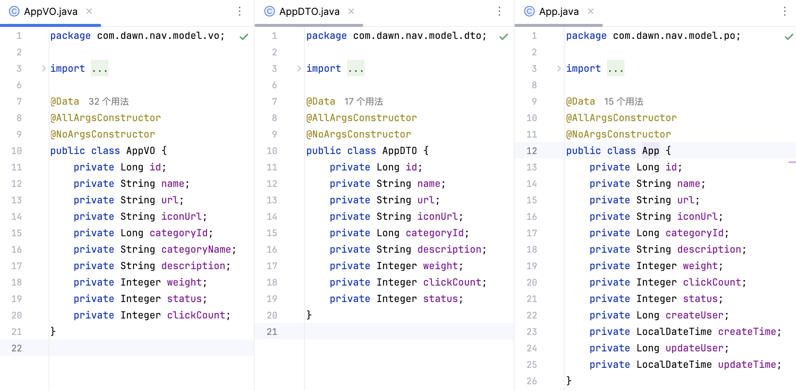
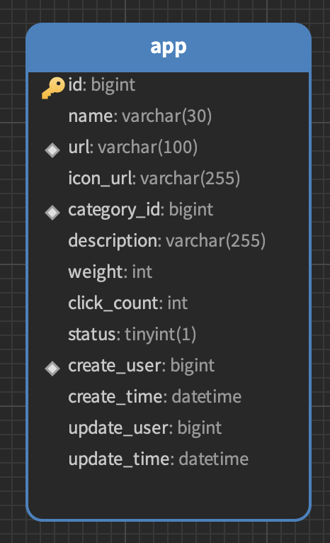

## Spring+Mybatis

## 结构

项目结构

```java
.
├── main  // 主项目源码
│   ├── java
│   │   └── com
│   │       └── dawn
│   │           └── nav
│   │               ├── admin            // 后台管理模块
│   │               │   ├── controller   // 控制层
│   │               │   ├── mapper       // 数据访问层
│   │               │   └── service      // 业务层
│   │               │       └── impl     // 业务实现
│   │               ├── authentication   // 认证模块
│   │               │   ├── config       // 认证配置
│   │               │   ├── handler      // 认证处理器
│   │               │   │   ├── exception // 认证异常
│   │               │   │   └── login     // 登录方式
│   │               │   │       ├── email     // 邮箱登录
│   │               │   │       ├── github    // GitHub登录
│   │               │   │       ├── linuxDo   // LinuxDo登录
│   │               │   │       └── username  // 用户名登录
│   │               │   └── resourceApi  // 资源接口
│   │               │       ├── adminApi   // 管理端接口
│   │               │       ├── publicApi  // 公共接口
│   │               │       └── userApi    // 用户端接口
│   │               ├── exception       // 全局异常处理
│   │               ├── model           // 数据模型
│   │               │   ├── constant    // 常量定义
│   │               │   ├── dto         // 数据传输对象
│   │               │   ├── enums       // 枚举类型
│   │               │   ├── po          // 持久化对象
│   │               │   ├── properties  // 属性配置
│   │               │   └── vo          // 视图对象
│   │               ├── user            // 前台用户模块
│   │               │   ├── controller  // 控制层
│   │               │   ├── mapper      // 数据访问层
│   │               │   └── service     // 业务层
│   │               │       └── impl    // 业务实现
│   │               └── util            // 工具类
│   └── resources   // 配置文件/资源文件
│       └── com
│           └── dawn
│               └── nav
│                   ├── admin
│                   │   └── mapper    // 后台管理 MyBatis 映射配置
│                   └── user
│                       └── mapper    // 前台用户 MyBatis 映射配置
└── test           // 测试代码
    └── java
        └── com
            └── dawn
                └── nav

```


核心业务逻辑结构

```java
.
├── controller                   // 控制器层
│   ├── CategoryAdminController.java // 分类管理控制器
│   ├── MenuController.java          // 菜单控制器
│   ├── SettingController.java       // 设置控制器
│   └── UserAdminController.java     // 用户管理控制器
├── mapper                       // 数据映射层
│   ├── CategoryAdminMapper.java      // 分类管理映射
│   ├── MenuMapper.java               // 菜单映射
│   └── SettingMapper.java            // 设置映射
└── service                      // 业务逻辑层
    ├── CategoryAdminService.java      // 分类管理服务
    ├── MenuService.java               // 菜单服务
    ├── SettingService.java            // 设置服务
    ├── UserAdminService.java          // 用户管理服务
    └── impl                       // 服务实现
        ├── CategoryAdminServiceImpl.java // 分类管理服务实现
        ├── MenuServiceImpl.java          // 菜单服务实现
        ├── SettingServiceImpl.java       // 设置服务实现
        └── UserAdminServiceImpl.java     // 用户管理服务实现

```

> user处理逻辑和上述一致

mapper -> service -> impl -> controller

## 数据

> 每个层都有自己的作用，各司其职



- VO - 视图对象 -> 用于前端展示的数据结构，包含业务逻辑处理后的数据，应用于展示层与服务层之间，支持前端的定制化展示需求
- DTO - 数据传输对象 -> 封装必要的数据，优化数据传输，应用于客户端与服务器、微服务之间及跨层数据传输
- PO -  持久化对象 -> 主要用于数据的持久化存储和数据库操作，严格对应数据库表结构，应用于数据访问层

